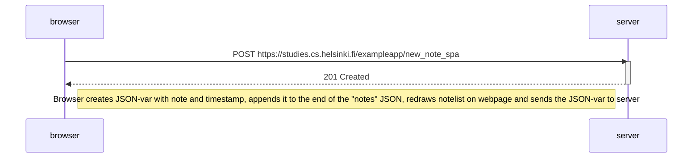

```mermaid
sequenceDiagram
    participant browser
    participant server

    browser->>server: POST https://studies.cs.helsinki.fi/exampleapp/new_note_spa
    activate server
    server-->>browser: 201 Created
    deactivate server

    Note right of browser: Browser creates JSON-var with note and timestamp, appends it to the end of the "notes" JSON, redraws notelist on webpage and sends the JSON-var to server
```